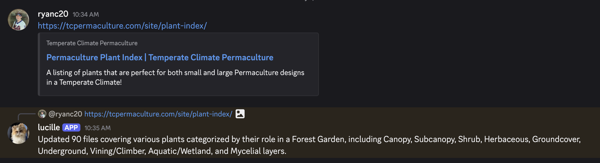
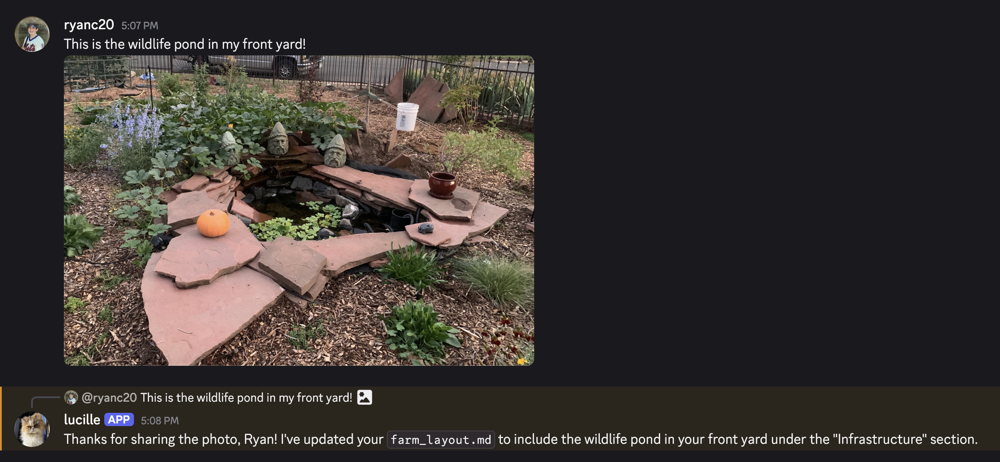

# Beanbot

A personal gardening assistant Discord bot powered by an agentic AI workflow.

**Built with:** Discord.py | LangGraph | Google Gemini | OpenWeatherMap | Docker

## Features

- **Agentic LangGraph workflow** — reason/act/synthesize loop with tool use. The agent decides when to read files, log entries, amend knowledge, or manage tasks.

- **Knowledge library** — markdown files in `data/` that grow organically. Includes plant guides, daily logs, and farm layout info.

- **Task Management** — Persistent todo list (`data/tasks.md`). The agent can schedule tasks with due dates, assign them to specific people, check them off upon completion, and remind you of urgent items during the daily briefing.

- **Multi-user task delegation** — Register household or garden members with `!register`. Tasks can be assigned to specific people (e.g. "remind George to weed"). Each person sees their own tasks plus unassigned ones. The daily briefing groups tasks by assignee with @mentions.

- **Harvest Tracking** — Structured harvest log (`data/harvests.md`). Track crops, amounts, and locations to monitor your garden's yield over time.

- **Planting Calendar** — Auto-generated calendar (`data/planting_calendar.md`) derived from the planting dates found in your knowledge library files.

- **Channel-based routing** — each Discord channel serves a different purpose:
  - **Journal** — log garden updates, harvests, and completed tasks
  - **Questions** — ask anything; the agent reads relevant knowledge files before answering
  - **Reminders** — receives the daily briefing; supports manual task management
  - **Knowledge Ingest** — paste URLs, upload files, or type text for auto-ingestion
  - **DMs** — general conversation

- **Daily briefing** — morning cron job. Fetches current weather and a 48-hour forecast, checks `tasks.md` for due items, reviews the `planting_calendar.md`, and reads recent logs to provide a morning summary. Includes frost/rain-based watering and protection advice. When members are registered, groups tasks by assignee with @mentions. Supports manual triggering via `!briefing`.

- **Evening debrief** — evening cron job. Posts a summary of open tasks in the journal channel with a **"Log Today's Debrief"** button. Clicking the button opens a Discord modal with 5 optional fields (Activities, Harvests, Pest/Disease, Observations, Task Updates). On submit, the structured data is sent through the LLM agent. Supports manual triggering via `!debrief`. Buttons persist across bot restarts.

- **Knowledge ingestion pipeline** — Send a URL, upload a file (including PDFs), or paste raw text. The bot extracts content, chunks it, and writes structured notes to per-topic markdown files. Source citations are tracked per topic, and contradictions with existing knowledge are flagged with conflict notes.

- **Link crawling** — When ingesting a URL, the bot discovers same-domain links on the page and offers to crawl and ingest them too. After ingestion, an optional step offers to update the planting calendar and create tasks from the new content.

- **Weather integration** — OpenWeatherMap API for current conditions and 48-hour forecast.

- **Proactive weather alerts** — Checks the forecast every 6 hours. Posts alerts to the reminders channel when frost (≤ 2°C) or significant rain (≥ 60% chance or ≥ 10mm) is expected. Max one alert per day.

- **Weekly recap** — Automatic 7-day garden summary every Sunday, posted to the reminders channel. Also available on-demand via `!recap [days]`.

- **Image understanding** — Upload garden photos for plant/pest identification or layout mapping via Gemini's vision capabilities.

- **Onboarding flow** — First-time setup via DM (`!setup`). The bot walks you through location/zone detection, garden layout, knowledge building guidance, and channel orientation. Creates `almanac.md` and `farm_layout.md` automatically.

- **Knowledge consolidation** — `!consolidate <topic>` merges related files into one clean document. `!consolidate` (no args) runs LLM-powered semantic categorization across the entire library. `!consolidate tasks` analyzes open tasks for duplicates with an interactive merge UI.

- **Clear & reset commands** — `!clear <topic>` deletes a single file (2-step confirm), `!clear knowledge` wipes all non-system files (3-step), `!clear garden` factory-resets everything (3-step).

- **Context window optimization** — Old conversation turns are automatically truncated before sending to the LLM. Bulky tool results (file reads), large ingestion payloads, and base64 images from previous turns are trimmed to save tokens while keeping the current turn fully intact.

- **Database maintenance** — Nightly pruning of conversation checkpoints. Ephemeral threads (daily reports, debriefs) are cleaned up after 7 days; persistent threads are trimmed to the last 20 checkpoints.

- **Docker deployment** — single `docker-compose up` with volume persistence.

## Screenshots

### Knowledge Ingestion
Share a link or upload a file — the bot extracts the content and saves it to your knowledge library.



### Task Management
Set tasks and reminders with natural language. The bot tracks due dates and assignees.


### Garden Photo Recognition
Upload a photo of your garden — the bot identifies what it sees and updates your layout.



## Quick Start

### 1. Create a Discord Bot

1. Go to the [Discord Developer Portal](https://discord.com/developers/applications) and create a new application.
2. Go to **Bot** → enable **Message Content Intent**.
3. Go to **OAuth2** → **URL Generator** → select `bot` scope with these permissions: Send Messages, Read Messages/View Channels, Read Message History, Embed Links, Attach Files, Use Slash Commands.
4. Copy the generated URL, open it in your browser, and invite the bot to your server.
5. Copy the **Bot Token** from the Bot page.

### 2. Get a Gemini API Key

1. Go to [Google AI Studio](https://aistudio.google.com/apikey).
2. Create a new API key (free tier is sufficient to start).

### 3. Get an OpenWeatherMap API Key

1. Sign up at [OpenWeatherMap](https://openweathermap.org/api).
2. The free tier works fine.

### 4. Get Your Channel IDs

1. In Discord, go to **User Settings** → **Advanced** → enable **Developer Mode**.
2. Create 4 channels in your server (e.g. `#reminders`, `#journal`, `#questions`, `#knowledge-ingest`).
3. Right-click each channel → **Copy Channel ID**.

### 5. Configure

```bash
cp .env.example .env
```

Edit `.env` and fill in your values.

### 6. Run

**Docker (recommended):**
```bash
docker-compose up --build -d
```

**Local:**
```bash
uv sync
uv run python -m src.bot
```

## Environment Variables

| Variable | Description |
|---|---|
| `DISCORD_TOKEN` | Your Discord bot token |
| `REMINDERS_CHANNEL_ID` | Channel ID for daily briefings and weather alerts |
| `JOURNAL_CHANNEL_ID` | Channel ID for journal updates and debrief |
| `QUESTIONS_CHANNEL_ID` | Channel ID for Q&A |
| `KNOWLEDGE_INGEST_CHANNEL_ID` | Channel ID for knowledge ingestion |
| `GOOGLE_API_KEY` | Gemini API key from [Google AI Studio](https://aistudio.google.com/apikey) |
| `GEMINI_MODEL` | Gemini model name (default: `gemini-2.5-flash`) |
| `OPENWEATHER_API_KEY` | OpenWeatherMap API key |
| `WEATHER_LAT` | Latitude for weather lookups |
| `WEATHER_LON` | Longitude for weather lookups |
| `BOT_TIMEZONE` | IANA timezone (default: `America/Denver`) |

## Architecture

| Module | Role |
|---|---|
| `src/bot.py` | Discord bot — routing, commands (`!briefing`, `!debrief`, `!consolidate`, `!consolidate tasks`, `!tasks`, `!recap`, `!setup`, `!register`, `!members`, `!clear`, `!commands`, `!version`), scheduled loops (daily report, debrief, weather alerts, weekly recap, DB prune), message parsing, debrief UI (modal + persistent view), ingestion pipeline (URL fetch, PDF extract, link crawling, calendar/task offers), onboarding flow, user identity injection |
| `src/graph.py` | LangGraph state machine — agent loop with tools, system prompt, SQLite checkpointer |
| `src/services/tools.py` | Core logic — file operations, task management, harvest logging, calendar generation, search, member registry, backup/restore |
| `src/services/weather.py` | Standalone async functions for current weather and 48-hour forecast via OpenWeatherMap |
| `src/services/categorization.py` | Direct LLM calls for semantic file categorization, merge suggestions, and task duplicate analysis |
| `data/` | Knowledge library — `tasks.md`, `harvests.md`, `planting_calendar.md`, `garden_log.md`, `almanac.md`, `farm_layout.md`, `categories.md`, `members.json`, `conversations.db`, and per-topic markdown files |

## Commands

- `!briefing` — Trigger the morning briefing manually (reminders or journal channel).
- `!debrief` — Trigger the evening debrief prompt (journal channel). Shows your assigned tasks + unassigned.
- `!tasks` — Show all open tasks grouped by assignee.
- `!consolidate` — Categorize all knowledge files by type, identify merge candidates, save to `categories.md`.
- `!consolidate <topic>` — Merge all files related to a topic into a single clean file (with backups).
- `!consolidate tasks` — Analyze open tasks for duplicates. Interactive UI lets you merge, keep, or remove duplicates.
- `!recap [days]` — Summarize the last N days of garden activity (default 7, max 90).
- `!setup` — Start the onboarding flow (walks you through location, garden layout, and orientation via DM).
- `!register <name>` — Register yourself as a named garden member. Use `!register <name> @user` to register someone else.
- `!members` — List all registered garden members.
- `!clear <topic>` — Delete a single knowledge file (2-step confirmation).
- `!clear knowledge` — Delete all non-system knowledge files (3-step confirmation).
- `!clear garden` — Factory reset: delete everything in `data/` (3-step confirmation).
- `!commands` — Show all commands with brief usage.
- `!version` — Show the current Beanbot version.

## How to Use

**Journal / Reminders / Questions** — Interact naturally in these channels. The agent uses tools to persist your data.

*   **Manage Tasks**
    *   "Remind me to prune the roses on Sunday."
    *   "What do I have to do today?"
    *   "I finished the pruning task."
    *   "Remind George to weed the herb garden."
    *   "What are George's tasks?"

*   **Track Harvests**
    *   "Harvested 3 lbs of beans from Bed 2."
    *   "Log a harvest of 10 zucchini."

*   **Consult Calendar**
    *   "When should I plant garlic?"
    *   "Generate a planting calendar."

*   **Log Updates**
    *   "Planted 3 rows of carrots in bed 1."

**Knowledge Ingest Channel** — Paste URLs, upload text/PDF files, or type knowledge directly. The bot extracts, chunks, and categorizes it.

## Running Locally

Requires Python 3.13+.

```bash
uv sync
uv run python -m src.bot
```

## Releasing

This project uses [bump-my-version](https://github.com/callowayproject/bump-my-version) for version management.

```bash
# Bump version (creates commit + tag)
# IMPORTANT: requires a clean git working tree — commit uv.lock first
uv run bump-my-version bump patch   # 1.0.0 → 1.0.1
uv run bump-my-version bump minor   # 1.0.0 → 1.1.0
uv run bump-my-version bump major   # 1.0.0 → 2.0.0
```

This updates `pyproject.toml` and `CHANGELOG.md`, creates a git commit, and tags it.
